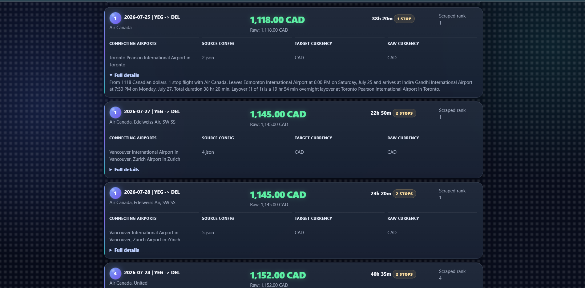

<p align="center">
  
</p>

# Airways

Airways is a Python, Flask, and Selenium based flight search automation and analytics dashboard for comparing Google Flights results across flexible one-way departure dates. It combines browser automation, data parsing, JSON-based configuration, currency conversion, result ranking, file-based persistence, and a local web dashboard into one end-to-end travel research tool.

The project is built like a small data pipeline: a user enters a route and date range, the system generates one search configuration per date, Selenium runs headless Chrome searches, parsed flight cards are normalized into structured Python data models, prices are converted into a target currency, and the best options are sorted by price, stops, and duration. Results are saved as human-readable reports and structured JSON that powers the dashboard.


## Preview

### Dashboard


### Results



## Features

- One-way flight searches across a selected departure date range.
- Airport-code based route input, for example `YEG` to `DEL`.
- Canada-focused defaults with configurable target currency.
- Selenium-powered Google Flights search automation.
- Parsed flight details for price, currency, airline, duration, stops, connecting airports, and full raw details.
- Best-deal ranking by converted price, then stops, then duration.
- Currency conversion for non-target-currency fares when exchange-rate data is available.
- Persistent outputs for generated configs, raw scrape text, final text reports, JSON reports, and run logs.
- Flask dashboard for running searches locally.
- Validation and safeguards for invalid airport codes, bad date ranges, missing prices, failed dates, and unavailable conversions.

## Tech Stack

| Area | Technologies Used |
| --- | --- |
| Backend | Python, Flask, pathlib, dataclasses, enums, typing |
| Automation | Selenium WebDriver, Headless Chrome, Selenium Manager / ChromeDriver |
| Data Processing | JSON, regular expressions, sorting, deduplication, validation, normalization |
| API / Networking | Frankfurter exchange-rate API, urllib, URL encoding |
| Frontend | HTML, CSS, JavaScript, Jinja-style Flask template rendering |
| CLI / Tooling | argparse, subprocess, Rich terminal output, logging |
| Storage | Local JSON files, text reports, generated config files, run logs |
| Workflow | Config-driven batch processing, modular scripts, dashboard-triggered pipeline |

Key project keywords: `Python`, `Flask`, `Selenium`, `Web Scraping`, `Browser Automation`, `Headless Chrome`, `Data Pipeline`, `JSON`, `REST API`, `Currency Conversion`, `Regex Parsing`, `Sorting Algorithms`, `Deduplication`, `Input Validation`, `Logging`, `CLI Tools`, `Dashboard`, `Full-Stack Development`, `System Design`.

## System Design

High-level flow:

```text
User Input
    |
    v
Flask Dashboard / trip.json
    |
    v
Trip Config Generator
    |
    v
Generated JSON Search Configs
    |
    v
Selenium Flight Search Runner
    |
    v
Google Flights Result Cards
    |
    v
Parser + Cleaner + Normalizer
    |
    v
Currency Conversion + Ranking
    |
    v
Text Report + JSON Report + Dashboard View
```

Module-level architecture:

```text
app.py
    |-- validates form input
    |-- writes trip.json
    |-- starts the search pipeline
    `-- renders ranked results in the browser

trip_configurator.py
    |-- reads trip.json
    |-- expands date ranges
    `-- creates one JSON config per search date

flight.py
    |-- creates Chrome WebDriver
    |-- builds Google Flights search URLs
    |-- waits for flight result cards
    `-- extracts raw flight details

flight_automation.py
    |-- loads generated configs
    |-- runs searches in batches
    |-- parses price, airline, stops, duration, and layovers
    |-- fetches exchange rates
    |-- sorts and deduplicates results
    `-- writes final reports

flight_orchestrator.py
    |-- combines config generation and search automation
    `-- provides a command-line workflow for complete runs
```

Data flow:

```text
trip.json
    -> all_trip_combinations/single_trip_combinations/*.json
    -> flights.txt
    -> ParsedFlight objects
    -> flight_results.json
    -> yeg_del_one_way_results.txt
    -> Flask dashboard results
```

Ranking logic:

```text
Available converted price
    -> lowest converted price
    -> fewer stops
    -> shorter total duration
    -> grouped by departure date
```

## Getting Started

### 1. Clone the Repository

```bash
git clone https://github.com/easyvansh/Airways.git
cd Airways
```

If your local folder has a different name, run the commands from that project directory.

### 2. Create a Virtual Environment

Windows PowerShell:

```powershell
python -m venv .venv
.\.venv\Scripts\Activate.ps1
```

macOS/Linux:

```bash
python -m venv .venv
source .venv/bin/activate
```

### 3. Install Dependencies

```bash
pip install -r requirements.txt
```

### 4. Run the App

```bash
python app.py
```

Open the dashboard at:

```text
http://127.0.0.1:5000
```

If port `5000` is already in use, stop the existing process or change the port in `app.py`.

## Usage

1. Open the local dashboard in your browser.
2. Enter the origin airport, destination airport, date range, currency, max results per date, and max stops.
3. Click `Run Search`.
4. Review the Best Overall section and the date-grouped results.
5. Use the generated text and JSON output files for saved analysis.

Default values are currently set for:

- Origin: `YEG`
- Destination: `DEL`
- Currency: `CAD`
- Date range: `2026-07-25` to `2026-07-28`

## Command Line Workflow

Edit `trip.json`:

```json
{
    "origins": ["YEG"],
    "destinations": ["DEL"],
    "departure_dates": [
        {
            "start": "2026-07-25",
            "end": "2026-07-28"
        }
    ],
    "search_modifier": "cheapest CAD"
}
```

Generate one search config per date:

```bash
python trip_configurator.py trip.json
```

Run the batch search:

```bash
python flight_automation.py --currency CAD --max-results-per-date 10
```

Or run the full orchestrator:

```bash
python flight_orchestrator.py trip.json
```

## Outputs

- `all_trip_combinations/single_trip_combinations/`: generated one-way search configs.
- `flights.txt`: latest raw scraped flight details from `flight.py`.
- `yeg_del_one_way_results.txt`: readable grouped report for the default YEG to DEL search.
- `flight_results.json`: structured report used by the dashboard.
- `flight_run_log.txt`: metadata, warnings, result counts, failed dates, and exchange-rate information.

## How It Works

1. `trip_configurator.py` expands `trip.json` into one JSON config per departure date.
2. `flight.py` opens Google Flights with Selenium using a route/date search URL.
3. `flight_automation.py` runs each generated config, parses flight details, converts prices when possible, sorts results, and writes reports.
4. `app.py` provides the Airways dashboard and calls the same pipeline.

## Project Structure

```text
Airways/
|-- ss/
|   |-- airways-logo.svg
|   |-- dashboard.png
|   `-- results.png
|-- all_trip_combinations/
|   `-- single_trip_combinations/
|-- app.py
|-- clean.py
|-- flight.py
|-- flight_automation.py
|-- flight_orchestrator.py
|-- flight_sorter.py
|-- LICENSE
|-- README.md
|-- requirements.txt
|-- trip.json
|-- flights.txt
|-- flight_results.json
|-- flight_run_log.txt
`-- yeg_del_one_way_results.txt
```

## File Guide

- `app.py`: Flask dashboard for entering search inputs, running searches, and displaying ranked results.
- `trip_configurator.py`: Generates per-date flight search configs from `trip.json`.
- `flight.py`: Selenium search engine that opens Google Flights and extracts flight card details.
- `flight_automation.py`: Batch runner, parser, sorter, currency converter, and report writer.
- `flight_orchestrator.py`: Runs config generation and automation together.
- `flight_sorter.py`: Older interactive sorter kept for compatibility.
- `clean.py`: Cleanup utility.
- `ss/`: Logo and README screenshot folder.
- `requirements.txt`: Python dependencies required to run the project.

## Notes

- Use airport codes when possible for better route accuracy.
- Keep date ranges reasonable; the web app currently limits searches to 31 days.
- Some Google Flights cards may show unavailable prices. These are preserved but sorted after priced results.
- Currency conversion only happens when a usable exchange rate is available.
- Google Flights markup can change, so scraping selectors may need maintenance over time.
- Prices and routes are live search snapshots, not booking guarantees.

## License

This project is licensed under the terms in [LICENSE](LICENSE).

## Disclaimer

Airways is for personal flight research and comparison. It uses browser automation against Google Flights, so use it responsibly and avoid excessive automated requests.
